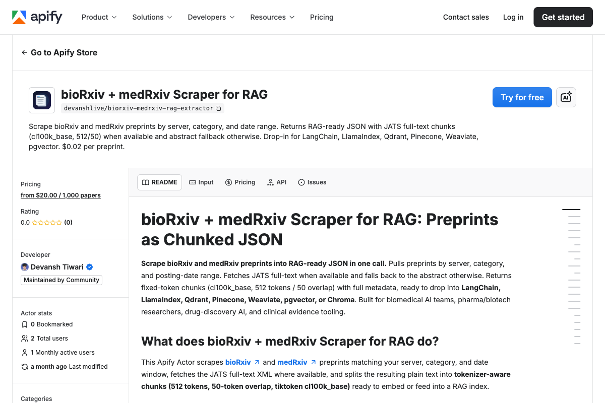

<div align="center">

# bioRxiv Scraper | Preprint Data Extraction API | Apify Actor

[](https://apify.com/devanshlive/biorxiv-medrxiv-rag-extractor)
[](https://nodejs.org/)
[](https://github.com/getascraper)
[](https://github.com/getascraper/how-to-scrape-biorxiv)

**bioRxiv scraper and preprint data extraction API. Extract biology papers and preprints from bioRxiv with this Apify actor. Free tier included.**

Built for biomedical researchers, drug discovery teams, and AI developers who need the fastest-moving scientific evidence before peer review.

[Quick Start](#quick-start) · [API Reference](#api-reference) · [Pricing](#pricing) · [Support](#support)



</div>

---

## Quick Start

```javascript
import { ApifyClient } from 'apify-client';
import 'dotenv/config';

const client = new ApifyClient({ token: process.env.APIFY_TOKEN });

const run = await client.actor('devanshlive/biorxiv-medrxiv-rag-extractor').call({
  servers: ['biorxiv', 'medrxiv'],
  category: 'neuroscience',
  dateFrom: '2024-01-01',
  dateTo: '2024-01-07',
  maxPreprints: 10,
});

const { items } = await client.dataset(run.defaultDatasetId).listItems();
console.log(items);
```

**Output:**
```json
{
  "doi": "10.1101/2024.03.15.585219",
  "server": "biorxiv",
  "version": "1",
  "title": "Novel CRISPR Applications in Neurodegeneration",
  "abstract": "We present a novel CRISPR-based approach...",
  "authors": ["Johnson M", "Chen L"],
  "category": "neuroscience",
  "publication_date": "2024-03-15",
  "preprint_url": "https://www.biorxiv.org/content/10.1101/2024.03.15.585219",
  "license": "cc_by",
  "source": "full_text",
  "chunks": [
    {
      "idx": 0,
      "text": "CRISPR-Cas9 has revolutionized gene editing...",
      "tokens": 512
    }
  ]
}
```

---

## Features

- **JATS XML parsing** for clean full-text extraction from preprints
- **bioRxiv and medRxiv** both supported in one Actor
- **Category filtering** by server-specific taxonomy
- **cl100k_base tokenization** with 512 tokens per chunk
- **License metadata** for compliance tracking

---

## What this actor does

This Actor extracts preprints from bioRxiv and medRxiv by server, category, and date range. It parses JATS XML to extract clean full text, falling back to abstracts when needed.

It supports server selection, category filtering, and date range queries. Each preprint includes DOI, version, authors, license, and token-aware chunks.

---

## Installation

```bash
npm install
```

Copy the environment file and add your Apify API token:

```bash
cp .env.example .env
```

Open `.env` and replace `your_apify_token_here` with your actual Apify API token. Get one free at [console.apify.com](https://console.apify.com/settings/integrations).

---

## Input

| Field | Type | Description | Default |
|-------|------|-------------|---------|
| `servers` | array | `biorxiv`, `medrxiv`, or both | none |
| `category` | string | Server-specific category slug | none |
| `dateFrom` | string | Start date (YYYY-MM-DD) | none |
| `dateTo` | string | End date (YYYY-MM-DD) | none |
| `maxPreprints` | integer | Max preprints to extract | 100 |

---

## Output

Each preprint is a structured JSON record with token-aware chunks. Download as JSON, CSV, Excel, or HTML.

| Field | Description |
|-------|-------------|
| `doi` | DOI (primary identifier, e.g. `10.1101/2024.03.15.585219`) |
| `server` | `biorxiv` or `medrxiv` |
| `version` | Preprint version returned by the API |
| `title` | Preprint title |
| `abstract` | Abstract as returned by the bioRxiv API |
| `authors` | Author display names in the order the API returned them |
| `category` | Server-specific category slug |
| `publication_date` | YYYY-MM-DD posting date |
| `preprint_url` | Canonical preprint landing page |
| `license` | Normalized license key: `cc_by`, `cc_by_nc`, `cc0`, `none`, or null |
| `source` | `full_text` or `abstract` (text origin) |
| `chunks` | Token-aware chunks for RAG |
| `chunks[].idx` | 0-indexed position |
| `chunks[].text` | Chunk text |
| `chunks[].tokens` | Token count (≤ 512) |

See `sample-output.json` for a full example.

---

## Pricing

**$0.02 per preprint.**

A run of 100 preprints typically completes in 1 to 2 minutes. Pay only for what you extract.

---

## Use Cases

- **Preprint monitoring:** Track the fastest-moving biomedical evidence before peer review
- **Drug discovery AI:** Build RAG corpora from preprints for target identification
- **Clinical evidence:** Extract medRxiv preprints for clinical decision support
- **Embedding pipelines:** Feed pre-chunked text into vector databases for biomedical Q&A

---

## FAQ

**What categories are available?**
Categories vary by server. bioRxiv categories include `neuroscience`, `genomics`, `bioinformatics`, etc. medRxiv categories include `clinical_trials`, `epidemiology`, etc.

**How does JATS parsing work?**
The Actor parses JATS XML to extract structured full text, handling figures, tables, and references automatically.

**Can I extract both servers at once?**
Yes. Pass `['biorxiv', 'medrxiv']` to the `servers` field.

---

## Support

Open an issue in the [Apify Console](https://console.apify.com/actors/devanshlive~biorxiv-medrxiv-rag-extractor/issues).

---

## Related Resources

- [bioRxiv API documentation](https://api.biorxiv.org/)
- [medRxiv API documentation](https://api.medrxiv.org/)
- [Apify Client for JavaScript](https://docs.apify.com/api/client/js/)

---

**Ready to start extracting?**

[Open the bioRxiv + medRxiv Scraper on Apify](https://apify.com/devanshlive/biorxiv-medrxiv-rag-extractor)
